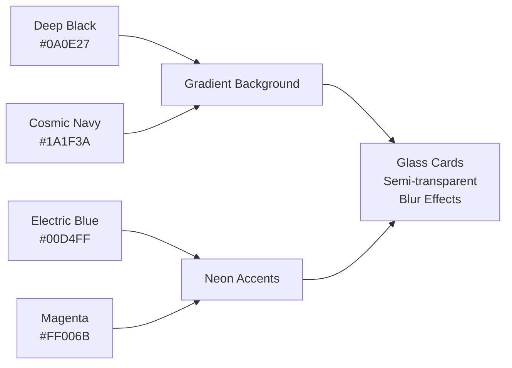
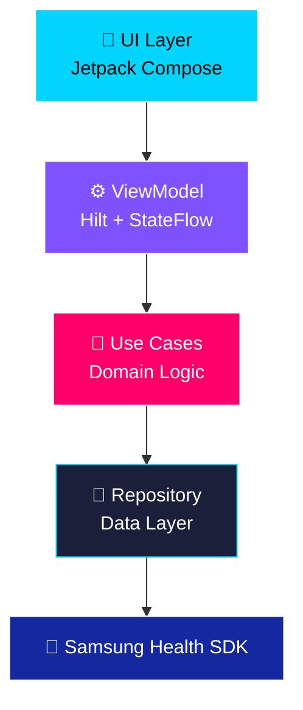

# Samsung Health Diary - Redesign Edition

> **Gemini 3 Pro Experimental Project** - A modernized redesign of Samsung's Health Diary sample app with stunning Liquid Glass UI aesthetics.
> 
> **Original Project**: [Samsung Health Diary Sample](https://developer.samsung.com/health/data/sample/health-diary.html)

<div align="center">


</div>

---

## ✨ Features

| Feature | Description | Status |
|---------|-------------|--------|
| 🚶 **Steps** | Daily/weekly/monthly tracking with swipe navigation | ✅ Complete |
| ❤️ **Heart Rate** | Real-time monitoring with breakdowns | ✅ Complete |
| 😴 **Sleep** | Session tracking with quality metrics | 🚧 In Progress |
| 🍎 **Nutrition** | Meal logging and calorie tracking | ✅ Complete |
| 🌓 **Dark/Light Mode** | Dynamic theme with DataStore persistence | ✅ Complete |

---

## 🎨 Design System

**Liquid Glass + Neo-Neon Aesthetic**



---

## 🏗️ Architecture



**Clean Architecture Pattern**: UI → ViewModel → UseCase → Repository → SDK

---

## 🚀 Tech Stack

| Category | Technology | Version |
|----------|-----------|---------|
| **Language** | Kotlin | 2.0.21 |
| **UI** | Jetpack Compose | BOM 2024.12.01 |
| **DI** | Hilt | 2.54 |
| **Navigation** | Compose Navigation | 2.8.5 |
| **Async** | Coroutines + StateFlow | 1.7.3 |
| **Storage** | DataStore Preferences | 1.1.1 |
| **Health SDK** | Samsung Health Data API | 1.0.0 |

---

## 📦 Project Structure

```
healthdiary/
├── 🎨 ui/
│   ├── screens/          # 6 feature screens
│   ├── components/       # Reusable UI (GlassCard, GlassBox, etc.)
│   └── theme/           # Material 3 + Custom colors
├── 🎯 domain/
│   ├── model/           # Domain entities
│   └── usecase/         # Business logic
├── 💾 data/
│   └── repository/      # Data sources
├── ⚙️ viewmodel/         # Hilt ViewModels
└── 🔧 di/               # Dependency injection modules
```

---

## ⚡ Quick Start

### Prerequisites

- Android Studio Hedgehog+
- JDK 17
- Android device with Samsung Health

### Build & Run

```bash
# Clone and open in Android Studio
./gradlew assembleDebug

# Or build release
./gradlew assembleRelease
```

### First Launch

1. Tap ⚙️ settings icon
2. Grant Samsung Health permissions
3. Start tracking! 🎉

---

## 🔐 Permissions

| Permission | Purpose |
|------------|---------|
| `READ_STEPS` | View step count |
| `READ_HEART_RATE` | Monitor heart rate |
| `READ_SLEEP` | Track sleep sessions |
| `READ_NUTRITION` | View meals |
| `WRITE_NUTRITION` | Log meals |

---

## 🎯 Key Improvements Over Original

| Aspect | Original | This Version |
|--------|----------|--------------|
| **UI Framework** | XML Views | 100% Jetpack Compose |
| **Design** | Material 2 | Liquid Glass + Neo-Neon |
| **Architecture** | Direct SDK calls | Clean Architecture (MVVM + UseCase) |
| **DI** | Manual Factory | Hilt |
| **State** | LiveData | StateFlow |
| **Theme** | Static | Persistent Dark/Light with DataStore |
| **Navigation** | Fragment-based | Compose Navigation |

---

## 📱 Screens Preview

| Screen | Features |
|--------|----------|
| **Home** | Glass cards for each health metric |
| **Steps** | Day/Week/Month views with HorizontalPager |
| **Heart Rate** | Daily breakdown by time periods |
| **Nutrition** | Meal tracking with CRUD operations |

---

## 📄 License

Copyright © 2024 Samsung Electronics Co., Ltd.

---

## 🙏 Attribution

- **Original Sample**: [Samsung Health Diary](https://developer.samsung.com/health/data/sample/health-diary.html)
- **Redesigned with**: Gemini 3 Pro & Antigravity
- **Design Inspiration**: Liquid Glass + Neo-Neon aesthetic

---

<div align="center">

**Built with ❤️ using Jetpack Compose**

</div>
