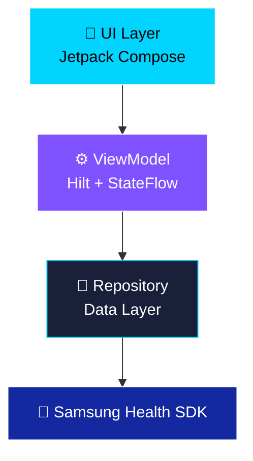

# Samsung Health Diary - Enhanced Edition

> **Modern Health Tracking App** - A beautifully redesigned Samsung Health integration app featuring stunning Liquid Glass UI aesthetics and comprehensive health metrics visualization.
> 
> **Original Project**: [Samsung Health Diary Sample](https://developer.samsung.com/health/data/sample/health-diary.html)

<div align="center">


</div>

---

## ✨ Features

| Feature | Description | Views | Status |
|---------|-------------|-------|--------|
| 👟 **Steps** | Daily/weekly/monthly tracking with visual charts | Day/Week/Month + Swipe Navigation | ✅ Complete |
| ❤️ **Heart Rate** | Real-time monitoring with detailed breakdowns | Daily View | ✅ Complete |
| 😴 **Sleep** | Session tracking with quality metrics (O₂, temp) | Daily Sessions | ✅ Complete |
| 💧 **Water Intake** | Hydration tracking with animated water visualization | Daily with Wave Animation | ✅ Complete |
| 🏋️ **Workout History** | Exercise tracking with charts and calendar | Day/Week/Month + Charts | ✅ Complete |
| 🍎 **Nutrition** | Meal logging and calorie tracking | CRUD Operations | ✅ Complete |
| 🌓 **Dark/Light Mode** | Dynamic theme with DataStore persistence | App-wide | ✅ Complete |

---

## 🎨 Design System

**Liquid Glass + Neo-Neon Aesthetic**

### Color Palette
- **Background**: Deep Black (#0A0E27) → Cosmic Navy (#1A1F3A) gradient
- **Glass Cards**: Semi-transparent with blur effects and subtle glows
- **Accents**: 
  - 🔵 Electric Blue (#00D4FF) - Steps
  - 💗 Hot Pink (#FF006B) - Heart Rate  
  - 💜 Neon Purple (#9B4DFF) - Sleep
  - 💙 Cyan (#4FC3F7) - Water
  - ❤️ Red/Orange (#FF6B6B) - Workouts

### UI Components
- **Glass Cards**: Frosted glass effect with radial glows
- **Emoji Icons**: Large, colorful emoji representations
- **Charts**: Bar charts (weekly) and calendar grids (monthly)
- **Animations**: Water wave effect, smooth transitions

---

## 🏋️ Feature Highlights

### Water Intake 💧
- **Animated Visualization**: Realistic water wave effect using Canvas
- **Sinusoidal Animation**: Continuous wave motion at top of liquid
- **Daily Goal Tracking**: Visual fill level based on intake vs. goal
- **Glass Container**: Beautiful container with gradient water colors

### Workout History 🏋️
- **40+ Exercise Types**: Running, Cycling, Swimming, Yoga, and more
- **Weekly Bar Chart**: Visual representation of workout frequency
- **Monthly Calendar**: Color-coded workout intensity indicators
  - Light Orange: 1 workout
  - Orange: 2 workouts
  - Red: 3+ workouts
- **Swipe Navigation**: Easily navigate between days/weeks/months
- **Emoji Icons**: 🏃 🚴 🏊 🧘 for each exercise type

### Modern Home Screen
- **2-Column Grid Layout**: Optimized space utilization
- **Large Emoji Cards**: 48sp emojis for each health category
- **Interactive Cards**: Radial glow effects matching category colors
- **Quick Access**: One-tap navigation to any health metric

---

## 🏗️ Architecture



**Clean Architecture Pattern**: UI → ViewModel → Repository → Samsung Health SDK

---

## 🚀 Tech Stack

| Category | Technology | Version |
|----------|-----------|---------|
| **Language** | Kotlin | 2.0.21 |
| **UI** | Jetpack Compose | BOM 2024.12.01 |
| **DI** | Hilt | 2.54 |
| **Navigation** | Compose Navigation | 2.8.5 |
| **Async** | Coroutines + StateFlow | 1.7.3 |
| **Storage** | DataStore Preferences | 1.1.1 |
| **Health SDK** | Samsung Health Data API | 1.0.0 |
| **Build** | Gradle 8.9 + AGP 8.8.0 | - |

---

## 📦 Project Structure

```
healthdiary/
├── 🎨 ui/
│   ├── screens/          # 7 feature screens
│   │   ├── HealthMainScreen.kt    # 2-column grid with emoji cards
│   │   ├── StepScreen.kt          # Day/Week/Month views
│   │   ├── HeartRateScreen.kt     # Heart rate monitoring
│   │   ├── SleepScreen.kt         # Sleep sessions
│   │   ├── WaterIntakeScreen.kt   # Animated water visualization
│   │   ├── ExerciseScreen.kt      # Workout charts & calendar
│   │   └── NutritionScreen.kt     # Meal tracking
│   ├── components/       # Reusable UI
│   │   ├── GlassCard.kt          # Glass effect cards
│   │   ├── ViewModeToggle.kt     # Day/Week/Month toggle
│   │   ├── WeeklyStepChart.kt    # Bar chart component
│   │   └── MonthlyCalendar.kt    # Calendar grid
│   └── theme/           # Material 3 + Custom colors
├── 💾 data/
│   └── repository/      # Samsung Health data access
├── ⚙️ viewmodel/         # Hilt ViewModels (7 total)
└── 🔧 di/               # Dependency injection modules
```

---

## ⚡ Quick Start

### Prerequisites

- **Android Studio**: Hedgehog (2023.1.1) or newer
- **JDK**: 17 or higher
- **Device**: Android 10+ with Samsung Health installed
- **Samsung Health**: Version 6.30.2 or later

### Build & Run

```bash
# Clone the repository
git clone [repository-url]
cd health-diary

# Build debug APK
./gradlew assembleDebug

# Or install directly to connected device
./gradlew installDebug
```

### First Launch

1. **Launch App** → Tap any health category card
2. **Grant Permissions** → Samsung Health will prompt for READ permissions
3. **Enable Developer Mode** in Samsung Health (tap version 10 times in About)
4. **Start Tracking!** 🎉

---

## 🔐 Permissions

All permissions are **READ-ONLY** for privacy and safety:

| Permission | Purpose | Data Types |
|------------|---------|------------|
| `READ_STEPS` | View daily/weekly/monthly step counts | `STEPS` |
| `READ_HEART_RATE` | Monitor heart rate measurements | `HEART_RATE` |
| `READ_SLEEP` | Track sleep sessions with metrics | `SLEEP`, `BLOOD_OXYGEN`, `SKIN_TEMPERATURE` |
| `READ_WATER_INTAKE` | View daily hydration levels | `WATER_INTAKE` |
| `READ_EXERCISE` | Access workout/exercise history | `EXERCISE` |
| `READ/WRITE_NUTRITION` | View and log meals | `NUTRITION` |

> ℹ️ **Note**: This app only reads data from Samsung Health. Water Intake and Workout History are display-only (no write access).

---

## 📱 Screens Overview

### Home Screen
- **2x3 Grid Layout** with large emoji cards
- **Categories**: Steps 👟, Heart Rate ❤️, Sleep 😴, Water 💧, Workouts 🏋️
- **Glass Effect** with radial glows per category
- **One-Tap Access** to each health metric

### Steps Screen
- **Day View**: Hourly breakdown with step counts
- **Week View**: 7-day bar chart (Sun-Sat)
- **Month View**: Full calendar with color-coded activity levels
- **Swipe Navigation**: Horizontal pager between time periods

### Water Intake Screen
- **Animated Glass**: Realistic water wave using Canvas
- **Dynamic Fill**: Visual representation of intake vs. goal
- **Smooth Animation**: Continuous sinusoidal wave motion
- **Daily Tracking**: Total intake display

### Workout History Screen
- **Day View**: List of workouts with time, duration
- **Week View**: Bar chart showing workout counts per day
- **Month View**: Calendar grid with workout intensity colors
- **Exercise Types**: 40+ types with unique emojis (🏃 🚴 🏊 🧘 🥊)

---

## 🎯 Key Improvements Over Original

| Aspect | Original | This Version |
|--------|----------|--------------|
| **UI Framework** | XML Views | 100% Jetpack Compose |
| **Design** | Material 2 | Liquid Glass + Neo-Neon |
| **Architecture** | Direct SDK calls | Clean Architecture (MVVM) |
| **DI** | Manual Factory | Hilt |
| **State** | LiveData | StateFlow |
| **Theme** | Static | Persistent Dark/Light with DataStore |
| **Navigation** | Fragment-based | Compose Navigation |
| **Charts** | Basic lists | Visual charts & calendars |
| **Animations** | None | Water waves, smooth transitions |
| **Home Screen** | List layout | 2-column grid with emojis |

---

## 🎨 Screenshots

<!-- Add your screenshots here -->
<!-- Example structure:
### Home Screen


### Workout History - Weekly Chart


### Water Intake Animation

-->

> 📸 **Screenshots coming soon!** Run the app and capture your own to see the beautiful Liquid Glass UI in action.

---

## 🚧 Future Enhancements

- [ ] Add write capabilities for Water Intake and Exercise
- [ ] Implement data export (CSV/JSON)
- [ ] Add widget support for quick stats
- [ ] Implement data sync across devices
- [ ] Add customizable goals and reminders
- [ ] Include more detailed analytics and insights

---

## 🐛 Known Issues

- Exercise type extraction needs Samsung Health data investigation (currently shows generic "Exercise")
- Custom exercise types may not display specific names

---

## 📄 License

Copyright © 2024 Samsung Electronics Co., Ltd.

---

## 🙏 Attribution

- **Original Sample**: [Samsung Health Diary](https://developer.samsung.com/health/data/sample/health-diary.html)
- **Samsung Health SDK**: [Developer Documentation](https://developer.samsung.com/health/android)
- **Redesigned with**: Gemini 3 Pro & Antigravity
- **Design Inspiration**: Liquid Glass + Neo-Neon aesthetic

---

<div align="center">

**Built with ❤️ using Jetpack Compose**

*Track your health, visualize your wellness journey* 🌟

</div>
